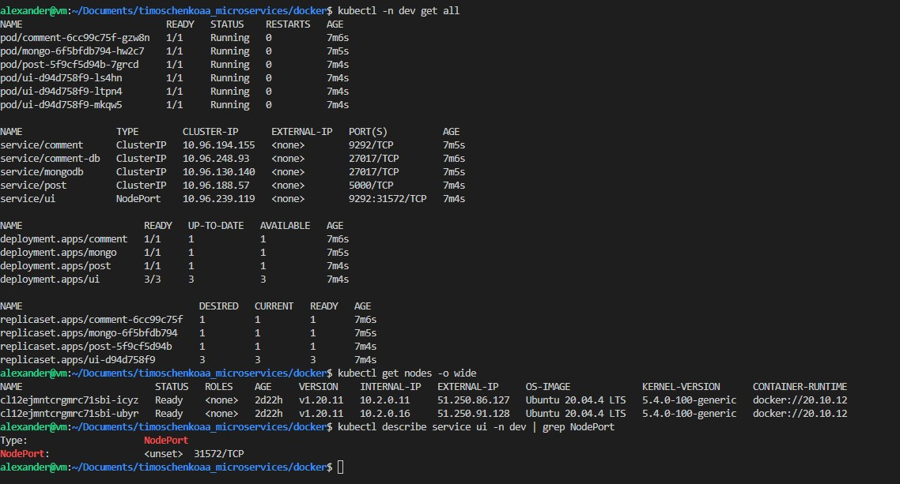
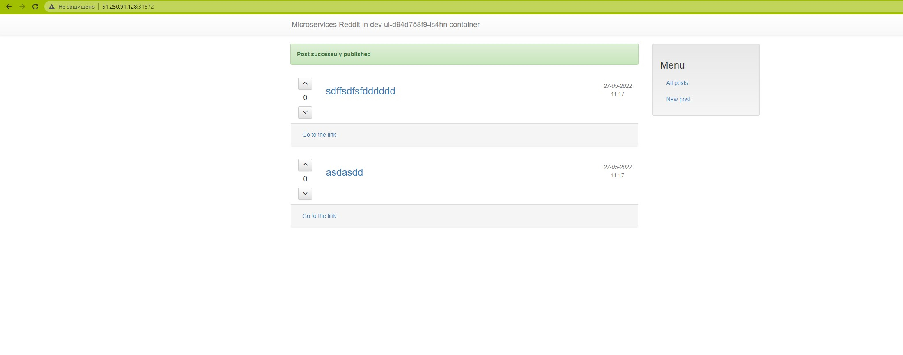

# timoschenkoaa_microservices
timoschenkoaa microservices repository

# ДЗ Технология контейнеризации. Введение в Docker

## Было выполнено:
 - Установил Docker, Docker compose, Docker Machine
 - Освоены базовые команды по запуску, останоке и работе с контейнерами.
 - Собрал образ с Ubuntu и запушил в hub.docker.com
 - Учетка на docker hub - timoschenkoaa@okbtsp.com; имя репы - xka1n. Поэтому все образы будут с тегом xka1n/image:tag

### Собранный образ:
```
FROM ubuntu:18.04
RUN apt-get update && \
    apt-get install -y mongodb-server ruby-full ruby-dev build-essential git && \
    gem install bundler && \
    git clone -b monolith https://github.com/express42/reddit.git
RUN sed -i "s/'mongo'$/'mongo', '~> 2.0.0'/" reddit/Gemfile    
COPY mongod.conf /etc/mongod.conf
COPY db_config /reddit/db_config
COPY start.sh /start.sh
RUN cd /reddit && rm Gemfile.lock && bundle install
RUN chmod 0777 /start.sh    
CMD ["/start.sh"]
```
### docker-1.log
```
REPOSITORY                      TAG       IMAGE ID       CREATED          SIZE
timoschenkoaa/ubuntu-tmp-file   latest    6de62e3792d4   47 seconds ago   63.2MB
ubuntu                          18.04     dcf4d4bef137   8 days ago       63.2MB
nginx                           latest    c316d5a335a5   2 weeks ago      142MB
hello-world                     latest    feb5d9fea6a5   4 months ago     13.3kB

// Команда docker inspect <u_container_id> описывает конфигурацию контейнера.
// Команда docker inspect <u_image_id> описывает конфигурацию образа.
```

# ДЗ Docker-образы. Микросервисы

## Было выполнено:
 - Разбили монолит на микросервисы
 - Создали сеть докера, подключили том для данных
 - оптимизировали образ

# ДЗ Docker: сети, docker-compose

### Узнайте как образуется базовое имя проекта. Можно ли его задать? Если можно то как?
В качестве базового имени проекта Docker-Compose использует имя папки. 
Соотв-но его можно изменить изменив название папки, содержащей Docker-compose файл. 
Также чтобы установить другое имя проекта, можно вызвать команду docker-compose --project-name NAME {up|down|...} либо добавить переменную COMPOSE_PROJECT_NAME=желаемое_имя_проекта в файле .env или добавлять поле container_name:
в файл docker-compose


# ДЗ Устройство Gitlab CI. Построение процесса непрерывной интеграции)

## Было выполнено
- Развернута vm с помощью yc cli.
- Используя docker-compose.yml развернут gitlab
- В gitlab проведены базовые настройки, создана группа и проект.
- Добавлен remote с проектом на gitlab к локальному репо.
- Создан .gitlab-ci.yml
- Добавлен и настроен runner
- Проверена работа pipeline-ов gitlab-а.
- Добавлены окружения, проверена работа пайплайнов с окружениями. Изучены и опробованы дианмические окружения.
- Опробована работа с тегами.


# ДЗ Введение в мониторинг. Системы мониторинга.

## Было выполнено
 - Изучена работа Prometheus 
 - Проработан мониторинг состояния микросервисов 
 - Добавлены экспортеры для сбора метрик 
 - Изучен ui-интерфейс Prometheus 
 - Создана сборка Prometheus в Docker-образ 
 - Собранные образы запушены в Docker-Hub https://hub.docker.com/repository/docker/xka1n

### Задание: Добавить в Prometheus мониторинг MongoDB 
Добавлен экспортер https://github.com/percona/mongodb_exporter

# ДЗ Логирование и распределенная трассировка

## Было выполнено
 - Пересобраны приложения с тегом logging.
 - Создан docker/docker-compose-logging.yml для EFK.
 - Создан Dockerfile, конфиг для fluentd, сбилжен и отправлен на dockerhub, а также добавлен в logging файл.
 - Добавлена настройка для post и ui для отправки логов в fluentd
 - Kibana: созданы index-pattern для индекса из потока fluentd, изучены логи приложения.
 - Добавлен фильтр по json, добавлен фильтр с парсером по явной регулярке в fluentd.
 - Изучены и добавлены описанные grok шаблоны в конфиг fluentd(распарсены часть полей логов сервиса ui).
 - Добавлен в docker-compose-logging zipkin - изучены возможности трассировки запросов.


# ДЗ Введение в kubernetes

## Было выполнено
- Создал кластер спомощью kubeadm
- Дополнительно создал кластера с помощью minikube, kubespray
- Написал манифесты и задеплоил их в кластера


# ДЗ Kubernetes. Запуск кластера и приложения. Модель безопасности

## Было выполнено

- Запустил в Yandex.Cloud кластер Kubenetes
- Изменил манифесты для запуска в кластере согласно методичке
- Изучил сущность services
- Задеплоил приложение и получил доступ через NodePort

## Вывод консоли с демонстрацией деплоя приложения в облаке


## Демонстрация работы приложения



# ДЗ Kubernetes. Networks,Storages.

## Было выполнено

- Поднял новый кластер, развернул заново все сервисы
- Создал pv, pvc 
- Сделал динамическое создание pvc
- Задеплоил ингресс Inginx ( не нравится он мне, Trarfik лучше)
- Поигрался с istio